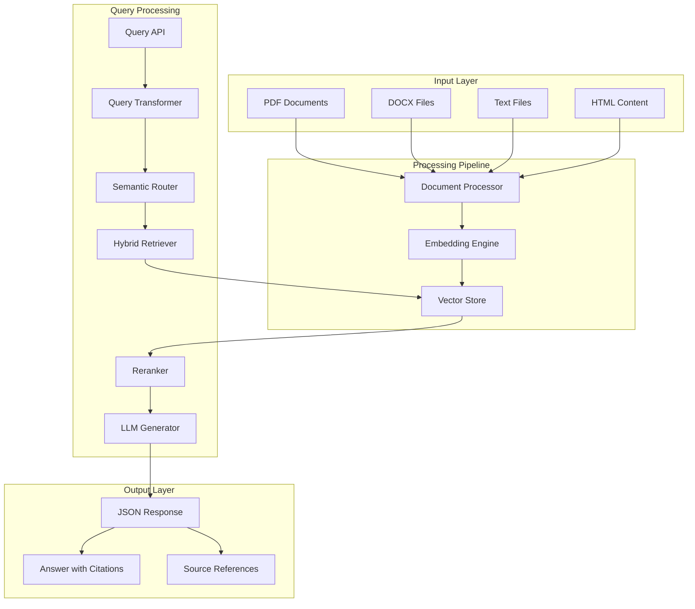

# Domain-Specific Semantic RAG System

A Retrieval-Augmented Generation (RAG) system designed for domain-specific applications such as legal, medical, and financial domains. This system features advanced query transformation, semantic routing, hybrid retrieval, and cross-encoder reranking for high-precision information retrieval and generation.

## Features

- **Multi-format Document Support**: Process PDF, DOCX, TXT, HTML, and Markdown files
- **Advanced Query Processing**: Query decomposition, expansion, and spelling correction
- **Semantic Routing**: Intelligent selection between dense and sparse retrieval strategies
- **Hybrid Retrieval**: Combination of vector similarity and keyword-based search
- **Cross-encoder Reranking**: Precision ranking of results using transformer models
- **Multi-LLM Support**: Integration with OpenAI, Anthropic, HuggingFace, and AWS Bedrock
- **Production Ready**: API endpoints, monitoring, caching, and containerization
- **Extensible Architecture**: Modular design for easy customization and extension

## Architecture Overview



## Quick Start

### Prerequisites

- Python 3.9+
- Redis (optional, for caching)
- API keys for your chosen LLM provider

### Installation

1. **Clone the repository**
   ```bash
   git clone https://github.com/Usamaniaz219/Domain-Specific-Sementic-Rag-System.git
   cd Domain-Specific-Sementic-Rag-System
   ```

2. **Install dependencies**
   ```bash
   pip install -r requirements.txt
   ```

3. **Configure environment variables**
   ```bash
   cp .env.example .env
   # Edit .env with your API keys and settings
   ```

4. **Run the application**
   ```bash
   python main.py
   ```

   Or using Docker:
   ```bash
   docker-compose up -d
   ```

### Usage Examples
 ```bash
1. **Ingest documents**
  #  ```bash
  curl -X POST "http://localhost:8000/api/v1/ingest" \
  -H "Content-Type: application/json" \
  -H "API-Key: my-rag-system-password-123" \
  -d '{
      "file_paths": [
          "./data/test1.txt",
          "./data/test2.txt"
      ]
  }'
   ```
```bash
2. **Query the system**
   <!-- ```bash -->
  curl -X POST "http://localhost:8000/api/v1/query" \
  -H "Content-Type: application/json" \
  -H "API-Key: my-rag-system-password-123" \
  -d '{
      "question": "What are the storage requirements for legal documents?",
      "user_id": "user-123"
  }'
   ```

3. **Check system health**
   ```bash
   curl http://localhost:8000/health
   ```

## API Documentation

### Endpoints

| Method | Endpoint | Description |
|--------|----------|-------------|
| POST | `/api/v1/ingest` | Ingest documents into the system |
| POST | `/api/v1/query` | Process a query and return results |
| POST | `/api/v1/feedback` | Submit feedback on query responses |
| GET | `/health` | System health check |
| GET | `/metrics` | Prometheus metrics |

### Query Request Format

```json
{
  "question": "What are the requirements for document storage?",
  "user_id": "optional-user-identifier",
  "conversation_history": [
    {
      "role": "user",
      "content": "Previous question"
    },
    {
      "role": "assistant", 
      "content": "Previous answer"
    }
  ]
}
```

### Response Format

```json
{
  "question": "What are the requirements for document storage?",
  "answer": "Based on the Legal Documents Act ....",
  "contexts": [
    {
      "text": "Document content...",
      "source": "document.pdf",
      "page_number": 15,
      "score": 0.92
    }
  ],
  "scores": [0.92, 0.87],
  "processing_time": 1.24,
  "strategy_used": "hybrid",
  "query_variations": ["transformed query 1", "query 2"],
  "model": "gpt-4",
  "usage": {
    "prompt_tokens": 456,
    "completion_tokens": 89,
    "total_tokens": 545
  }
}
```

## Configuration

### Environment Variables

Key configuration options in `.env`:

```ini
# LLM Provider Settings
LLM_PROVIDER=openai
LLM_MODEL=gpt-4
OPENAI_API_KEY=your-api-key

# Vector Store Settings
VECTOR_STORE_TYPE=chroma
EMBEDDING_MODEL=sentence-transformers/all-mpnet-base-v2

# Performance Settings
CHUNK_SIZE=512
CHUNK_OVERLAP=50
TOP_K_RETRIEVAL=10
TOP_K_RERANK=3

# API Settings
API_KEY=your-secret-api-key
API_HOST=0.0.0.0
API_PORT=8000
```

### Supported LLM Providers

- OpenAI (GPT-4, GPT-3.5-Turbo)
- Gemini
- Anthropic (Claude models)
- HuggingFace (local models)
- AWS Bedrock

### Supported Vector Stores

- ChromaDB (default, local)
- Pinecone (cloud)
- Weaviate (self-hosted or cloud)

## Advanced Usage

### Custom Document Parsers

Extend the system by adding custom parsers:

```python
# In custom_parsers.py
from core.document_processor import DocumentProcessor

class CustomDocumentProcessor(DocumentProcessor):
    def _load_custom_format(self, file_path: Path) -> str:
        # Implement custom parsing logic
        return parsed_content

# Update settings.py to use custom processor
DOCUMENT_PROCESSOR_CLASS = "custom_parsers.CustomDocumentProcessor"
```

### Custom Retrieval Strategies

Implement domain-specific retrieval logic:

```python
# In custom_retrieval.py
from core.vector_store import VectorStore

class CustomVectorStore(VectorStore):
    def _domain_specific_search(self, query_vector, domain_keywords):
        # Domain-specific retrieval logic
        return results
```

### Monitoring and Metrics

The system exposes Prometheus metrics at `/metrics`:

- `http_requests_total`: Total API requests
- `http_request_duration_seconds`: Request latency
- `rag_processing_time`: RAG pipeline performance
- `embedding_cache_hits`: Cache efficiency metrics

## Development

### Project Structure

```
rag_system/
├── api/                 # FastAPI application and routes
├── config/              # Configuration settings
├── core/                # Core RAG components
├── models/              # Database models and schemas
├── tests/               # Test cases
├── utils/               # Utility functions
└── data/                # Document storage
```


### Adding New Features

1. Follow the modular architecture pattern
2. Add tests for new functionality
3. Update documentation
4. Ensure backward compatibility

## Deployment

### Docker Deployment

```bash
# Build and run with Docker Compose
docker-compose up -d

# Scale workers
docker-compose up -d --scale rag-api=4
```

## Performance Tuning

### Optimizing for Specific Domains

1. **Legal Documents**: Increase chunk size to 1024, focus on precise retrieval
2. **Medical Research**: Use domain-specific embeddings (e.g., BioBERT)
3. **Financial Reports**: Implement table extraction and numeric reasoning

## Troubleshooting

### Common Issues

1. **Document parsing failures**: Check file permissions and format support
2. **High response times**: Enable caching and optimize chunk size
3. **Low accuracy**: Adjust similarity threshold and reranker parameters

### Debug Mode

Enable debug logging for troubleshooting:

```ini
# In .env
DEBUG=true
LOG_LEVEL=DEBUG
```

## Contributing

1. Fork the repository
2. Create a feature branch
3. Add tests for new functionality
4. Submit a pull request

## License

This project is licensed under the MIT License - see the LICENSE file for details.

## Support

For support and questions:

- Create an issue on GitHub
- Check the documentation
- Review existing issues for solutions


**Note**: This system is designed for production use but should be thoroughly tested for your specific use case before deployment in critical environments.